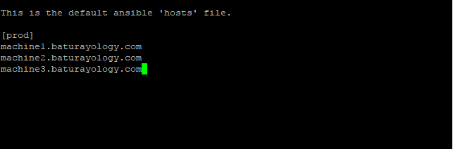

# How to install and configure Ansible on CentOS in order to manage Windows hosts?

## Windows Hosts Setup :

1. Download the powershell script from https://github.com/ansible/ansible/blob/devel/examples/scripts/ConfigureRemotingForAnsible.ps1 and run it as administrator on all Windows machines that you want to manage.
   
2. Check the port "5986" is listening.
    netstat -ano | find "5986"

## Control Machine Setup :

1. Python is needed for Ansible to work. Check if Python is installed on your control machine and install it if not exist. (Run "python" command in the terminal to see if python is installed or not)  
     sudo yum install python
     
2. Install python package management system (pip).  
     sudo yum install python-pip
     
3. Install pywinrm module to manage Windows hosts.  
     pip install pywinrm
     
4. Install EPEL release for CentOS to find "ansible" packages in repository.  
     sudo yum install epel-release
     
5. Install Ansible. (Default path for Ansible is : /etc/)  
     sudo yum install ansible
     
6. Edit "/etc/ansible/hosts" file to create your hosts. You can define multiple groups in your hosts file also.  
     sudo nano /etc/ansible/hosts  
     
       
     
     You see there is a group named "prod" in the hosts file. You can define groups like "[group_name]" and list the servers under it.
     
7. Create "group_vars" directory under "/etc/ansible".  
     mkdir group_vars /etc/ansible
     
8. Create a directory(ies) named with your group(s) under "/etc/ansible/group_vars/" (ex: You have "prod" group in your /etc/ansible/hosts file then you create a directory named "prod")  
     mkdir prod /etc/ansible/group_vars  
     
     You should create separate directories for different groups in your "/etc/ansible/hosts" file.
      
9. Create file named "vars" under your group directory. (ex: /etc/ansible/group_vars/prod/)  
     sudo nano /etc/ansible/group_vars/prod/vars
     
10. Configure "vars" file with below credentials for first use (will be updated after "ansible" user is created on all hosts)
 
      ansible_connection: winrm  
      ansible_port: 5986  
      ansible_winrm_server_cert_validation: ignore  
      ansible_user: baturay  
      ansible_password: mypassword  
      ansible_winrm_operation_timeout_sec: 60  
      ansible_winrm_read_timeout_sec: 70  

     You need an administrator account to use Ansible remotely. We can use it to create "ansible" user on all hosts.  

     Your "vars" file should look like this :  

     
        
11. Create file named "vault" under your group directory (ex: /etc/ansible/group_vars/prod/)  
     sudo nano /etc/ansible/group_vars/prod/vault
     
12. Vault file is used to keep sensitive variables that is in "vars" file. Add your sensitive variables to "vault" file by adding "vault_" at the beginning of your variable name. (ex: You have "ansible_password" variable in "vars" file, then   you should have "vault_ansible_password" variable in the "vault" file).
 
     Your "vault" file should look like this :  

     
     
13. Create "playbooks" directory under "/etc/ansible/".  
     mkdir playbooks /etc/ansible/
     
14. Create "manage_win_users.yml" file under "/etc/ansible/playbooks/" (sudo nano manage_win_users.yml /etc/ansible/playbooks/) and configure it like below :  
        &nbsp;&nbsp;&nbsp;-  
          &nbsp;&nbsp;&nbsp;&nbsp;&nbsp;gather_facts: false  
          &nbsp;&nbsp;&nbsp;&nbsp;&nbsp;hosts: "{{ hosts }}"  
          &nbsp;&nbsp;&nbsp;&nbsp;&nbsp;name: "Manage Windows Users"  
          &nbsp;&nbsp;&nbsp;&nbsp;&nbsp;tasks:  
            &nbsp;&nbsp;&nbsp;&nbsp;&nbsp;&nbsp;&nbsp;&nbsp;-  
              &nbsp;&nbsp;&nbsp;&nbsp;&nbsp;&nbsp;&nbsp;&nbsp;&nbsp;&nbsp;&nbsp;name: "Configure a User"  
              &nbsp;&nbsp;&nbsp;&nbsp;&nbsp;&nbsp;&nbsp;&nbsp;&nbsp;&nbsp;&nbsp;win_user:  
              &nbsp;&nbsp;&nbsp;&nbsp;&nbsp;&nbsp;&nbsp;&nbsp;&nbsp;&nbsp;&nbsp;groups:  
              &nbsp;&nbsp;&nbsp;&nbsp;&nbsp;&nbsp;&nbsp;&nbsp;&nbsp;&nbsp;&nbsp;&nbsp;&nbsp;&nbsp;- Administrators  
              &nbsp;&nbsp;&nbsp;&nbsp;&nbsp;&nbsp;&nbsp;&nbsp;&nbsp;&nbsp;&nbsp;groups_action: add  
              &nbsp;&nbsp;&nbsp;&nbsp;&nbsp;&nbsp;&nbsp;&nbsp;&nbsp;&nbsp;&nbsp;name: "{{ name }}"  
              &nbsp;&nbsp;&nbsp;&nbsp;&nbsp;&nbsp;&nbsp;&nbsp;&nbsp;&nbsp;&nbsp;password: "{{ password }}"  
              &nbsp;&nbsp;&nbsp;&nbsp;&nbsp;&nbsp;&nbsp;&nbsp;&nbsp;&nbsp;&nbsp;password_never_expires: true  
              &nbsp;&nbsp;&nbsp;&nbsp;&nbsp;&nbsp;&nbsp;&nbsp;&nbsp;&nbsp;&nbsp;state: "{{ state }}"  

      You should check the syntax of your .yml file every time when you edit it. (See "Checking The Syntax of YML Files" section of this document)  
 
      The parts written in "{{ }}" mean that their value will be passed as an argument while running the script. (See "Passing Variables to Playbooks" section of this document)

15. Now we are ready to create "ansible" user on all our Windows hosts. Run the command :  
      sudo ansible-playbook /etc/ansible/manage_win_users.yml --extra-vars "hosts=prod name=ansible password=ansibleuserpassword state=present"

      Check if all are ok.

      Also you can connect to one of the host machines and check if the user is created under Computer Management. (but it is not necessary)

16. We do not need to use other administrator user (now we have "ansible" user) anymore, so we should edit our "vars" and "vault" files. Open /etc/ansible/group_vars/prod/vars file and edit it like below :

      ansible_connection: winrm  
      ansible_port: 5986  
      ansible_winrm_server_cert_validation: ignore  
      ansible_user: ansible  
      ansible_password: ansibleuserpassword  
      ansible_winrm_operation_timeout_sec: 60  
      ansible_winrm_read_timeout_sec: 70  
         
17. Open /etc/ansible/group_vars/prod/vault and change the password with "ansible" user's one.

18. Run below commands to encrypt "vars" and "vault" files. It will ask for a new vault password, set a secure one.  
      sudo ansible-vault encrypt /etc/ansible/group_vars/prod/vars  
      sudo ansible-vault encrypt /etc/ansible/group_vars/prod/vault
      
## Checking The Syntax of YML Files :

1. Open your .yml file.
2. Copy all the content.
3. Go to http://www.yamllint.com/
4. Paste your content.
5. Click "Go".
6. Copy verified content to your .yml file.
7. Save your file.

## Passing Arguments to Playbooks :
   You need to add "--extra-vars" option to your command (ex: --extra-vars "hosts=prod")
   
   hosts : You can define hosts on which you want to run the script. They should be defined on /etc/ansible/hosts file.  
   name : This is the name of the user that you want to create on the remote machine.  
   password : This is the password of the user that you want to create on the remote machine.  
   state : This is used to choose either you want to add a user or delete it. Use "present" to add and "absent" to delete.
   
## Extras :

  You can check and use other options of win_user module of Ansible by editing your .yml file. More information about win_user module: http://docs.ansible.com/ansible/win_user_module.html  
  
  For general documentation and all other features of Ansible, see http://docs.ansible.com/

